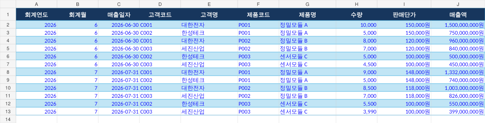
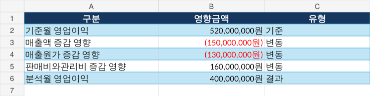

# 월마감 손익 변동 원인분석 시스템

ERP·Excel에서 추출한 월별 상세 데이터를 이용해 **영업이익이 왜 변했는지를 금액으로 분해하고, 세부 원인과 원본 데이터까지 추적하는 재무데이터 분석 프로젝트**입니다.

> **프로젝트 성격:** 포트폴리오 및 프로토타입  
> **데이터:** 실제 기업 데이터가 아닌 합성(Synthetic) 데이터  
> **중요:** 현재 버전은 운영 ERP를 대체하는 상용 재무시스템이 아닙니다.

---

## 프로젝트 개요

일반적인 손익 대시보드는 매출액, 매출원가, 영업이익이 **얼마나 변했는지**를 보여줍니다.

이 프로젝트는 그 다음 단계인 **“왜 변했는가?”**에 초점을 둡니다.

```text
영업이익 변동
   ↓
매출 / 매출원가 / 판매비와관리비 영향 분해
   ↓
제품 / 고객 / 원가구분 / 계정과목별 원인 추적
   ↓
관련 원본 데이터 확인
   ↓
계산된 사실을 기반으로 경영보고 초안 생성
```

### 핵심 질문

- 이번 달 영업이익은 전월 대비 얼마나 변했는가?
- 매출, 매출원가, 판매비와관리비 중 무엇이 가장 큰 영향을 줬는가?
- 매출 변동은 판매량 때문인가, 판매단가 때문인가?
- 제조원가 상승은 어느 원가구분·제품에서 발생했는가?
- 판관비 증가는 어느 계정과목·부서·거래처에서 발생했는가?
- 예산 대비 실적 차이는 얼마인가?
- 분석 결과를 원본 데이터까지 내려가 확인할 수 있는가?

---

## 핵심 기능

- **월별 손익 비교**
  - 매출액
  - 매출원가
  - 매출총이익
  - 판매비와관리비
  - 영업이익
  - 영업이익률

- **영업이익 변동 브리지 분석**
  - 매출 영향
  - 매출원가 영향
  - 판매비와관리비 영향

- **매출 변동 원인분석**
  - 판매량효과
  - 판매단가효과
  - 신규판매 / 판매중단 효과

- **제조원가 원인추적**
  - 원가구분 → 제품

- **판매비와관리비 원인추적**
  - 계정과목 → 부서 → 거래처

- **예산 대비 실적 분석**

- **경영보고 초안 생성**
  - AI가 임의로 숫자를 계산하지 않고, 분석 엔진에서 계산된 결과를 기반으로 작성

- **회사별 Excel 구조 대응**
  - 시트명과 열 이름을 화면에서 직접 연결

- **대시보드 내 데이터 수정**
  - 금액
  - 수량
  - 계정과목
  - 제품
  - 고객
  - 부서 등

- **코딩 없는 화면 설정**
  - 프로젝트 제목
  - 메뉴명
  - 분석도구명
  - 열 표시명
  - 금액단위 등

---

## 사용 흐름

```text
1. Excel / CSV 업로드
        ↓
2. 시트·열 연결
        ↓
3. 원본 데이터 확인 및 수정
        ↓
4. 손익 분석
        ↓
5. 영업이익 변동 원인분해
        ↓
6. 제품·고객·원가·계정별 원인 추적
        ↓
7. 경영보고 초안 확인
```

---

## 기술 구성

```text
Excel / CSV
     ↓
Pandas
     ↓
재무 분석 엔진
     ↓
Streamlit
     ↓
Plotly / 분석표 / 경영보고
```

- Python
- Pandas
- Streamlit
- Plotly
- Excel 입출력 라이브러리

---

## 실행 방법

### Windows

저장소를 내려받은 뒤 `START_HERE.bat`를 실행합니다.

### 직접 실행

```bash
pip install -r requirements.txt
streamlit run app.py
```

### 분석 엔진 테스트

```bash
python tests/test_engine.py
```

---

## 검산용 Demo

`sample_data/demo/`에는 분석 로직 검산을 위해 의도적으로 설계한 합성 데이터가 들어 있습니다.

### 주요 손익 결과

| 항목 | 2026년 6월 | 2026년 7월 | 변동 |
|---|---:|---:|---:|
| 매출액 | 5,000,000,000원 | 4,850,000,000원 | -150,000,000원 |
| 매출원가 | 3,200,000,000원 | 3,330,000,000원 | +130,000,000원 |
| 판매비와관리비 | 1,280,000,000원 | 1,120,000,000원 | -160,000,000원 |
| **영업이익** | **520,000,000원** | **400,000,000원** | **-120,000,000원** |

### 영업이익 변동 브리지

```text
매출액 영향             -150,000,000원
매출원가 영향           -130,000,000원
판매비와관리비 영향      +160,000,000원
-----------------------------------
영업이익 변동            -120,000,000원
```

브리지의 각 영향금액 합계가 실제 영업이익 변동액과 일치하는지 검산합니다.

---

## 결과 미지정 Random Test

`sample_data/random/`에는 **분석 결과를 먼저 정하지 않고 원본 값을 난수로 생성한 합성 데이터 5종**이 있습니다.

목적은 특정 검산용 데이터에만 맞춘 분석이 아니라, **처음 보는 입력에도 동일한 분석 로직이 적용되는지 확인하는 것**입니다.

- `01_랜덤샘플_A.xlsx`
- `02_랜덤샘플_B.xlsx`
- `03_랜덤샘플_C.xlsx`
- `04_랜덤샘플_D.xlsx`
- `05_랜덤샘플_E.xlsx`

---

## 스크린샷

### 샘플 데이터



### 샘플 분석 결과



> 실제 Streamlit 실행 화면 스크린샷은 향후 추가 예정입니다.

---

## 폴더 구조

```text
monthly-profit-variance-analysis/
├─ app.py
├─ analysis_engine.py
├─ launcher.py
├─ requirements.txt
├─ START_HERE.bat
├─ RUN.bat
├─ TEST.bat
│
├─ settings/
│
├─ sample_data/
│  ├─ demo/
│  │  └─ 한빛정밀_월마감_손익분석_샘플.xlsx
│  │
│  └─ random/
│     ├─ 01_랜덤샘플_A.xlsx
│     ├─ 02_랜덤샘플_B.xlsx
│     ├─ 03_랜덤샘플_C.xlsx
│     ├─ 04_랜덤샘플_D.xlsx
│     └─ 05_랜덤샘플_E.xlsx
│
├─ sample_result/
├─ tests/
│  └─ test_engine.py
│
├─ assets/
└─ docs/
```

---

## 검증 상태

### 확인 완료

- Python 분석 엔진 샘플 자동 테스트: **20개 PASS**
- 손익 계산식 검산
- 영업이익 변동 브리지 합계 검산
- 판매량·판매단가 효과 검산
- 예산 대비 실적 검산
- 랜덤 샘플 Excel 5종의 시트·열 구조 확인

### 아직 확인하지 못한 항목

- 실제 기업 ERP 직접 연결
- 실제 사용자 권한·로그인·감사로그
- 수십만~수백만 행 규모의 대용량 성능
- 실제 기업 월마감 데이터 기반 UAT
- 개발환경 외 Windows PC에서의 전체 실행 검증
- 다양한 브라우저 환경에서의 UI 검증

따라서 현재 프로젝트는 **재무 분석 로직과 UI 흐름을 검증한 프로토타입**이며, 실제 기업 운영환경에 투입하기 위해서는 추가 검증이 필요합니다.

자세한 내용은 [검증 및 한계](docs/03_검증_및_한계.md)를 참고하세요.

---

## 설계 원칙

### 1. 숫자 계산을 AI에 맡기지 않음

손익 계산과 변동분해는 Python/Pandas 기반 분석 로직에서 수행합니다.

```text
원본 데이터
   ↓
계산
   ↓
검산
   ↓
원인 추적
   ↓
설명 / 보고
```

AI 또는 자연어 설명 기능은 계산된 결과를 설명하는 역할로 제한하는 방향을 적용했습니다.

### 2. 사실과 추정을 구분

데이터에서 확인할 수 없는 원인을 임의로 단정하지 않습니다.

예를 들어 운반비가 증가했다면:

- **확인 가능:** 운반비가 전월 대비 얼마나 증가했는가
- **추가 확인:** 어느 부서·거래처·원본 데이터에서 증가했는가
- **단정 금지:** 실제 근거 없이 “유가 상승 때문에 증가했다”고 판단

### 3. 원본 데이터까지 추적

결과 숫자만 보여주는 것이 아니라 가능한 범위에서 세부 데이터까지 내려가 원인을 확인하도록 설계했습니다.

---

## 향후 개선 방향

- SQL DB 연동
- 회계 전표번호 수준까지 Drill-down
- ERP별 자동 매핑 템플릿
- 사용자 수정이력 및 감사로그
- 사용자 권한 관리
- 대용량 데이터 성능 테스트
- 실제 월마감 데이터 기반 UAT
- 실제 Streamlit 화면 스크린샷 추가

---

## 관련 문서

- [프로젝트 소개](docs/01_프로젝트_소개.md)
- [데이터 구조](docs/02_데이터_구조.md)
- [검증 및 한계](docs/03_검증_및_한계.md)

---

## 주의사항

이 저장소의 회사명, 거래처명, 고객명, 금액 및 거래 데이터는 모두 프로젝트 검증을 위해 생성한 **합성 데이터**입니다. 실제 기업의 내부 재무정보를 포함하지 않습니다.
